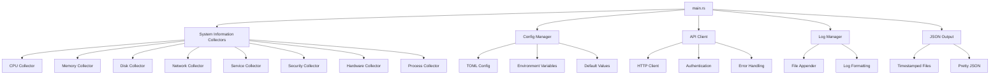

# StaffLinuxMonitor - Component Architecture Documentation

**Version:** 1.0.2  
**Date:** Generated automatically  

## Table of Contents

1. [Architecture Overview](#architecture-overview)
2. [Component Diagram](#component-diagram)
3. [Core Components](#core-components)
4. [Data Flow](#data-flow)
5. [Component Interactions](#component-interactions)
6. [Configuration Management](#configuration-management)
7. [Extension Points](#extension-points)

---

## Architecture Overview

StaffLinuxMonitor follows a modular architecture with clearly separated concerns:

```
┌─────────────────────────────────────────────────────────────┐
│                    StaffLinuxMonitor                        │
├─────────────────────────────────────────────────────────────┤
│  ┌─────────────┐  ┌─────────────┐  ┌─────────────────────┐  │
│  │   Main      │  │   Config    │  │    Log Config       │  │
│  │  Monitor    │◄─┤  Manager    │  │     Manager         │  │
│  │             │  │             │  │                     │  │
│  └─────────────┘  └─────────────┘  └─────────────────────┘  │
│         │                                                   │
│  ┌─────────────┐  ┌─────────────┐                          │
│  │   System    │  │   API       │                          │
│  │ Information │  │  Client     │                          │
│  │ Collectors  │  │             │                          │
│  └─────────────┘  └─────────────┘                          │
│         │                 │                                │
│  ┌─────────────────────────┐                               │
│  │    JSON Output          │                               │
│  │    Manager              │                               │
│  └─────────────────────────┘                               │
└─────────────────────────────────────────────────────────────┘
```

### Design Principles

1. **Separation of Concerns**: Each module handles specific functionality
2. **Modularity**: Components can be modified independently
3. **Error Resilience**: Graceful degradation when components fail
4. **Performance**: Minimal resource usage with configurable intervals
5. **Extensibility**: Easy to add new collectors and outputs

---

## Component Diagram



---

## Core Components

### 1. Main Monitor Component (`main.rs`)

**Responsibility:** Application lifecycle, daemon management, and orchestration

**Key Functions:**
- `main()` - Application entry point and daemon setup
- `run_monitor()` - Main monitoring loop
- `get_system_info()` - Orchestrates data collection

**Dependencies:**
- `sysinfo` crate for system information
- `daemonize` crate for background operation
- `anyhow` for error handling
- `log` for logging

**Configuration:**
```rust
// Daemon configuration
let daemonize = Daemonize::new()
    .pid_file("/tmp/staffmon.pid")
    .chown_pid_file(true)
    .working_directory(".")
    .user("nobody")
    .group("nobody")
    .umask(0o027);
```

---

### 2. System Information Collectors

#### CPU Information Collector

**Function:** `get_cpu_info(sys: &System) -> CpuInfo`

**Data Sources:**
- `sysinfo::System` for usage and frequency
- Future: temperature sensors via `/sys/class/thermal/`

**Performance Impact:** Very low - uses existing system data

---

#### Memory Information Collector  

**Function:** `get_memory_info(sys: &System) -> MemoryInfo`

**Data Sources:**
- `sysinfo::System` for memory statistics
- Calculations for usage percentages

**Output Format:**
```json
{
  "total_mb": 16384,
  "used_mb": 8192,
  "free_mb": 8192
}
```

---

#### Disk Information Collector

**Function:** `get_disk_info(sys: &System) -> Vec<DiskInfo>`

**Data Sources:**
- `sysinfo::System::disks()` for mounted filesystems
- Automatic GB conversion from bytes

**Features:**
- Multi-disk support
- Mount point detection
- Space calculations

---

#### Network Information Collector

**Function:** `get_network_info(sys: &System) -> NetworkInfo`

**Data Sources:**
- `sysinfo::System::networks()` for interface statistics
- `ip addr show` command for IP addresses
- Fallback to `ifconfig` for compatibility

**Fallback Strategy:**
```rust
// Primary: ip command
let ip_output = Command::new("ip")
    .args(["addr", "show", name])
    .output();

// Fallback: ifconfig command
if ip_addresses.is_empty() {
    let output = Command::new("ifconfig")
        .arg(name)
        .output();
}
```

---

#### Service Information Collector

**Function:** `get_services() -> Vec<ServiceInfo>`

**Supported Init Systems:**
1. **systemd** (preferred): `systemctl list-units --type=service`
2. **SysV init**: `/etc/init.d/` directory listing
3. **OpenRC**: `/etc/rc.d/` directory listing

**Service Detection Logic:**
```rust
// Try multiple service name variants
let service_names = match service {
    "mysql" => vec!["mysql", "mariadb", "mysqld"],
    "redis" => vec!["redis", "redis-server"],
    "nginx" => vec!["nginx", "nginx-main"],
    _ => vec![service],
};
```

---

#### Security Information Collector

**Function:** `get_security_info() -> SecurityInfo`

**Security Checks:**
- **Firewall Status**: UFW via `ufw status`
- **Intrusion Prevention**: fail2ban via `fail2ban-client status`
- **Open Ports**: `ss -tuln` command
- **Package Updates**: Package manager specific commands

---

#### Hardware Information Collector

**Function:** `get_hardware_info() -> HardwareInfo`

**Information Sources:**
- `lscpu` - CPU model and specifications
- `nproc` - CPU core count
- `free -m` - Memory totals
- `lsblk` - Block device information
- `dmidecode` - System vendor/model (requires root)

---

#### Package Manager Detection

**Function:** `detect_package_manager() -> PackageManager`

**Detection Strategy:**
```rust
// Priority order detection
if command_exists("apt") { PackageManager::Apt }
else if command_exists("yum") { PackageManager::Yum }
else if command_exists("dnf") { PackageManager::Dnf }
else if command_exists("pacman") { PackageManager::Pacman }
else if command_exists("zypper") { PackageManager::Zypper }
else { PackageManager::Unknown }
```

**Update Commands by Package Manager:**
- **apt**: `apt list --upgradable`
- **yum**: `yum check-update`
- **dnf**: `dnf check-update`
- **pacman**: `pacman -Qu`
- **zypper**: `zypper list-updates`

---

### 3. Configuration Manager (`config.rs`)

**Responsibility:** Configuration loading and validation

**Configuration Sources (Priority Order):**
1. Command line arguments (future)
2. Environment variables (`STAFFMON_*`)
3. Configuration file (`config.toml`)
4. `.env` file
5. Default values

**Configuration Structure:**
```rust
#[derive(Debug, Serialize, Deserialize)]
pub struct ApiConfig {
    pub base_url: String,       // API endpoint
    pub api_key: String,        // Authentication
    pub timeout_seconds: u64,   // Request timeout
    pub retry_count: u32,       // Retry attempts
    pub rate_limit: u32,        // Requests per minute
}
```

**Example Configuration File:**
```toml
# config.toml
base_url = "https://api.example.com"
api_key = "your-secret-key"
timeout_seconds = 30
retry_count = 3
rate_limit = 100
```

---

### 4. API Client (`api.rs`)

**Responsibility:** HTTP communication with external services

**Features:**
- Configurable timeouts and retries
- Authentication via API keys
- JSON serialization/deserialization
- Error handling and logging

**HTTP Client Configuration:**
```rust
let client = Client::builder()
    .timeout(Duration::from_secs(config.timeout_seconds))
    .build()?;
```

**API Endpoints:**
- `POST /api/v1/system-info` - Send system information
- `GET /api/v1/system-info` - Retrieve system information

**Request Headers:**
```
Content-Type: application/json
X-API-Key: {configured_api_key}
```

---

### 5. Log Manager (`log_config.rs`)

**Responsibility:** Logging configuration and management

**Logging Configuration:**
- **Log Level**: Info and above
- **Output**: File (`logs/staffmon.log`)
- **Format**: `{timestamp} [{level}] {message}`
- **Rotation**: Manual (future: automatic rotation)

**Log Directory Structure:**
```
project_root/
├── logs/
│   └── staffmon.log
├── system_info_YYYYMMDD_HHMMSS.json
└── config.toml
```

---

### 6. JSON Output Manager

**Responsibility:** Data serialization and file management

**Features:**
- Pretty-printed JSON output
- Timestamped filenames
- Automatic directory creation
- Error handling for disk space issues

**File Naming Convention:**
```
system_info_{YYYYMMDD_HHMMSS}.json
```

**Example Output:**
```json
{
  "timestamp": "2024-01-15T10:30:00+00:00",
  "hostname": "server01",
  "cpu": {
    "usage_percent": 45.2,
    "temperature_celsius": null,
    "frequency_mhz": 2400.0
  },
  "memory": {
    "total_mb": 16384,
    "used_mb": 8192,
    "free_mb": 8192
  }
}
```

---

## Data Flow

### 1. Initialization Phase

```
main() → init_logger() → load_config() → create_api_client() → start_daemon()
```

### 2. Monitoring Loop

```
run_monitor() → {
    get_system_info() → {
        refresh_system() →
        collect_cpu_info() →
        collect_memory_info() →
        collect_disk_info() →
        collect_network_info() →
        collect_services() →
        collect_security_info() →
        collect_hardware_info() →
        collect_process_list()
    } →
    save_to_json() →
    send_to_api() →
    sleep(2_seconds)
}
```

### 3. Error Handling Flow

```
Error Occurred → {
    Log Error →
    Continue Operation (graceful degradation) →
    Retry if applicable →
    Alert if critical
}
```

---

## Component Interactions

### 1. Main Monitor ↔ System Collectors

**Interface:** Function calls with `&System` parameter
**Data Flow:** Unidirectional (main → collectors)
**Error Handling:** Collectors return default values on failure

### 2. Main Monitor ↔ Configuration Manager

**Interface:** `ApiConfig::load()` method
**Data Flow:** Configuration data to main monitor
**Error Handling:** Falls back to defaults

### 3. Main Monitor ↔ API Client

**Interface:** `ApiClient` methods
**Data Flow:** Bidirectional JSON over HTTP
**Error Handling:** Logs errors, continues operation

### 4. Main Monitor ↔ Log Manager

**Interface:** Standard Rust `log` macros
**Data Flow:** Log messages to file
**Error Handling:** Graceful degradation if logging fails

### 5. API Client ↔ External Services

**Interface:** REST API over HTTP/HTTPS
**Authentication:** API key in headers
**Data Format:** JSON
**Error Handling:** Retry with exponential backoff (future)

---

## Configuration Management

### Environment Variable Override

All configuration can be overridden via environment variables:

```bash
export STAFFMON_BASE_URL="https://api.production.com"
export STAFFMON_API_KEY="prod-secret-key"
export STAFFMON_TIMEOUT_SECONDS=60
```

### Configuration Validation

The system validates configuration at startup:
- URL format validation
- Timeout range checking
- API key presence (if API enabled)

### Configuration Hot Reload

**Current:** Requires restart
**Future:** Signal-based configuration reload

---

## Extension Points

### 1. Adding New Collectors

To add a new information collector:

1. **Define Data Structure:**
```rust
#[derive(Debug, Serialize)]
struct NewInfo {
    pub field1: String,
    pub field2: u64,
}
```

2. **Implement Collector Function:**
```rust
fn get_new_info() -> NewInfo {
    // Implementation
}
```

3. **Integrate into SystemInfo:**
```rust
struct SystemInfo {
    // existing fields...
    pub new_info: NewInfo,
}
```

4. **Update Collection Function:**
```rust
fn get_system_info() -> SystemInfo {
    // existing collectors...
    let new_info = get_new_info();
    
    SystemInfo {
        // existing assignments...
        new_info,
    }
}
```

### 2. Adding New Output Formats

Currently supports JSON. To add new formats:

1. **Define Serializer:**
```rust
fn save_to_xml(info: &SystemInfo) -> io::Result<()> {
    // XML serialization implementation
}
```

2. **Add to Main Loop:**
```rust
// In run_monitor()
save_to_json(&system_info)?;
save_to_xml(&system_info)?;  // New format
```

### 3. Adding New API Endpoints

To support additional API endpoints:

1. **Extend ApiClient:**
```rust
impl ApiClient {
    pub fn send_alerts(&self, alerts: &Vec<Alert>) -> Result<()> {
        // Implementation
    }
}
```

2. **Add Configuration:**
```rust
pub struct ApiConfig {
    // existing fields...
    pub alerts_endpoint: String,
}
```

### 4. Adding New Package Managers

To support additional package managers:

1. **Extend Enum:**
```rust
enum PackageManager {
    // existing variants...
    Portage,  // Gentoo
    Pkg,      // FreeBSD
}
```

2. **Update Detection:**
```rust
fn detect_package_manager() -> PackageManager {
    // existing checks...
    else if command_exists("emerge") { PackageManager::Portage }
    else if command_exists("pkg") { PackageManager::Pkg }
}
```

3. **Add Update Command:**
```rust
fn get_package_updates() -> Vec<String> {
    match pkg_manager {
        // existing cases...
        PackageManager::Portage => {
            // emerge implementation
        }
    }
}
```

---

## Performance Considerations

### Memory Usage
- **Baseline:** ~5MB RAM
- **Peak:** ~10MB during data collection
- **Optimization:** Collectors use minimal memory allocation

### CPU Usage
- **Average:** <2% CPU during collection
- **Spikes:** Brief spikes during system command execution
- **Optimization:** Commands run with minimal flags

### Disk I/O
- **JSON Files:** One write per collection cycle
- **Log Files:** Buffered writes
- **Optimization:** Asynchronous I/O (future improvement)

### Network Usage
- **API Calls:** One HTTP request per collection cycle
- **Payload Size:** ~5-20KB per request
- **Optimization:** Compression support (future)

---

## Security Considerations

### Privilege Requirements
- **Basic Monitoring:** User-level privileges sufficient
- **Hardware Info:** Root required for `dmidecode`
- **Service Status:** User-level sufficient for most services

### Data Sensitivity
- **System Information:** Generally non-sensitive
- **Process List:** May contain sensitive command lines
- **Network Info:** IP addresses may be sensitive

### API Security
- **Authentication:** API key based
- **Transport:** HTTPS recommended
- **Validation:** Input validation on API endpoints

### File Permissions
- **Log Files:** 0644 (readable by owner/group)
- **JSON Files:** 0644 (readable by owner/group)
- **PID File:** 0644 (readable by all)

---

This component documentation provides a comprehensive overview of the StaffLinuxMonitor architecture, enabling developers to understand, modify, and extend the system effectively.